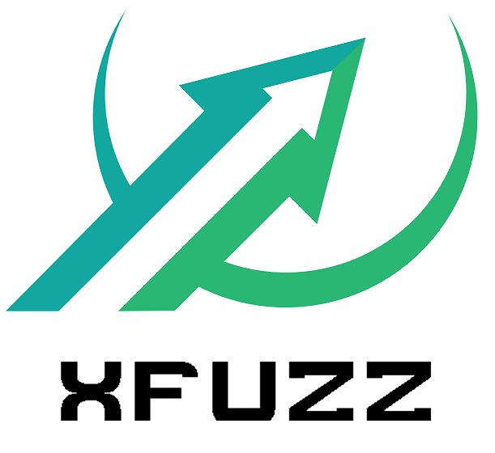

# xFuzz



Cross-contract vulnerabilities are vulnerabilities where more than two contracts are involved by external calls. Cross-contract call itself is generally not vulnerable. However, it is prone to being leveraged by existing vulnerabilities and deceive current vulnerability detection technologies. For example, a cross-contract vulnerability is missed by existing detection tools is shown in the following code.

```javascript
 1 contract Trader {
 2     TokenSale tokenSale = new TokenSale(); // internal contract
 3 
 4     function combination() {
 5         tokenSale.buyTokensWithWei();
 6         tokenSale.buyTokens(beneficiary);
 7     }
 8 }
 9 
10 contract TokenSale {
11     TokenOnSale tokenOnSale; // external contract
12 
13     function set(address _add) {
14         tokenOnSale = TokenOnSale(_add);
15     }
16
17     function buyTokens(address beneficiary) {
18         if (starAllocationToTokenSale > 0) {
19             tokenOnSale.mint(beneficiary, tokens);
20         }
21     }
22
23     function buyTokensWithWei() onlyTrader {
24         wallet.transfer(weiAmount);
25     }
26 }
```

[test](./test.md)