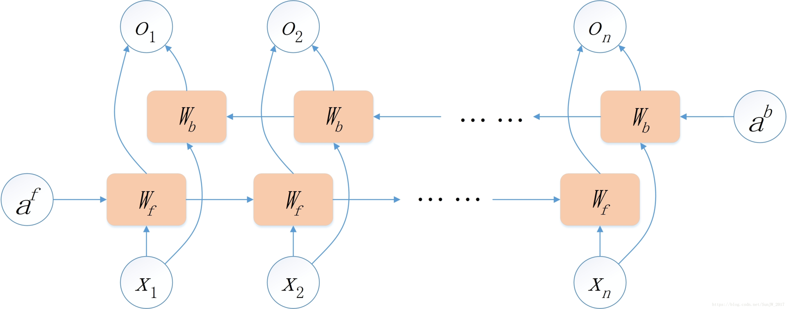
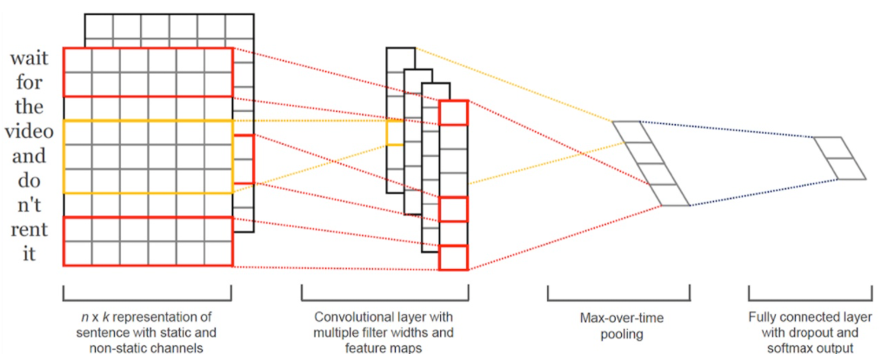
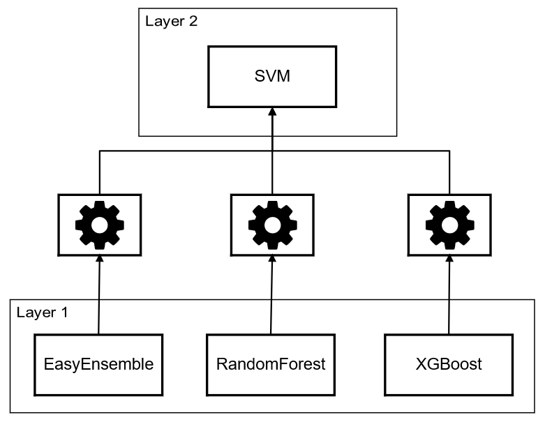

## Training machine learning models

We adopt tree-based models in our paper as final predictor. However, due to page limitations, the reasons of not choosing deep-learning models are not explictly explained. In this page, we explain our observations as a complementary material to the paper.

#### Bi-LSTM

The structure of the LSTM model is shown in the following pictures:





We trained the LSTM model but the model performs far worse than other models. In our validation dataset, the output of the LSTM model is shown in the following code.

```
    LABEL:
    1, 1, 1, 0, 1, 0, 0, 1, 0, 1, 1, 1, 1, 1, 0, 1, 0, 0, 1, 1, 0, 1, 
    0, 1, 1, 0, 0, 0, 0, 0, 0, 1, 1, 1, 0, 0, 1, 0, 0, 0, 1, 1, 0, 1, 
    0, 1, 0, 1, 0, 0, 0, 0, 1, 0, 1, 0, 0, 0, 0, 0, 0, 0, 0, 0, 1, 0, 
    1, 1, 0, 0, 1, 0, 1, 0, 0, 1, 0, 1, 0, 1, 1, 1, 1, 1, 0, 0, 1, 0, 
    0, 0, 1, 0, 1, 1, 0, 0, 0, 0, 1, 0, 0, 0, 0, 0, 1, 0, 0, 1, 1, 0

    PREDICT:
    0, 0, 0, 0, 0, 0, 0, 0, 0, 0, 0, 0, 0, 0, 0, 0, 0, 0, 0, 0, 0, 0,
    0, 0, 0, 0, 0, 0, 0, 0, 0, 0, 0, 0, 0, 0, 0, 0, 0, 0, 0, 0, 0, 0, 
    0, 0, 0, 0, 0, 0, 0, 0, 0, 0, 0, 0, 0, 0, 0, 0, 0, 0, 0, 0, 0, 0, 
    0, 0, 0, 0, 0, 0, 0, 0, 0, 0, 0, 0, 0, 0, 0, 0, 0, 0, 0, 0, 0, 0, 
    0, 0, 0, 0, 0, 0, 0, 0, 0, 0, 0, 0, 0, 0, 0, 0, 0, 0, 0, 0, 0, 0
```


It is obviously that the model is overfitted and always predict major class **0** (i.e., the benign code) by ignoring features of vulnerable samples. Therefore the LSTM models are deemed incapable in this work.

#### Model-stacking

We also tried to stack existing models to counteract bias of each model so that find a model with better performance. The structure of our stack models are shown in the following picture.



However, the performance of the stacked models is not satisfactory to our expectations. The reason is that the features input to **layer 2 models** is diluted without recoganizable features compared with features input to the **layer 1 models**, which makes the model difficult to learn the features. Moreover, the models in layers are too powerful to eliminate their bias, narrowing the impact of weak models.